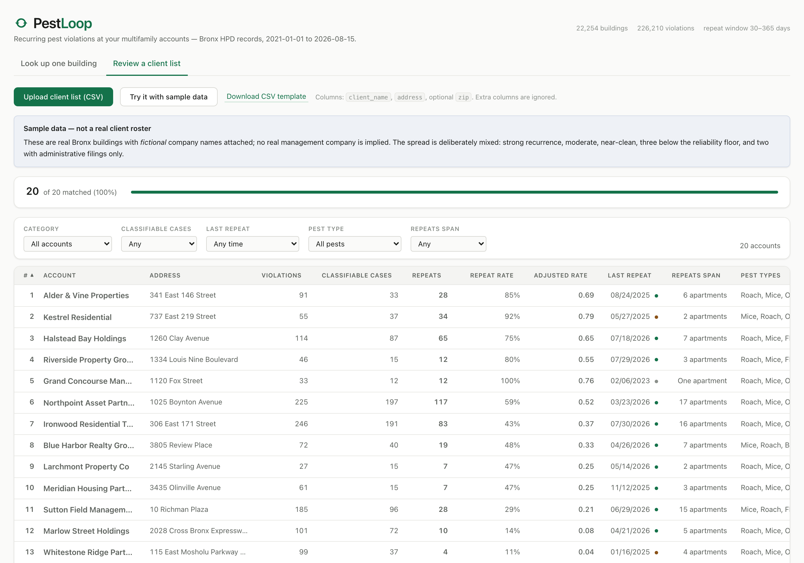

# PestLoop
[Live Demo](https://jianting-li.github.io/Pest-Loop/)

**Tells a pest-control account manager which of their multifamily clients have a pest problem that keeps *coming back* — not just one with a lot of violations.**

Built on 226,210 real NYC HPD violation records, aggregated into a 22,254-building recurrence dataset. Fully static: no backend, no server, no API token ever reaches the browser.



## Notable

- **Caught a real methodology bug before it shipped.** The first pass measured recurrence at the building level — the rate turned out to just be a proxy for violation volume (82% positive, rising monotonically with case count). Re-derived it at the apartment level instead; the signal became real (35% overall, genuine spread). Documented in-repo with the before/after numbers.
- **Deterministic, explainable ranking — no black-box score.** Priority = a [Wilson-score confidence interval](src/lib/ranking.js) (so 6-of-8 outranks 1-of-1) × a recency weight. Every input is a visible table column; any row's rank can be checked by hand.
- **Zero credentials in the client.** The Socrata API token is read once, at build time, by a Node script (`scripts/fetch-data.js`) that writes static JSON. The deployed app fetches only those files — verified by auditing the production bundle for the token string and the API host.
- **Handles messy real-world input.** Address normalization (suffix/directional/ordinal expansion), fuzzy CSV column matching, and an unmatched-rows review queue rather than silent drops.
- **Full interaction-state coverage**, not just the happy path: loading, empty, error, and partial-success states throughout; `prefers-reduced-motion` respected; light/dark theming; keyboard-accessible custom tooltips.

## Try it

```bash
npm install
npm run fetch-data   # pulls + aggregates HPD data (needs a Socrata token in .env — see below)
npm run dev
```

`fetch-data` needs `SOCRATA_APP_TOKEN` in a `.env` file — copy `.env.example` and fill in a free key ([sign up here](https://data.cityofnewyork.us/profile/edit/developer_settings)). The token is only ever read by this Node script, never by the app. The aggregated output is already committed under `public/data/`, so `npm run dev` alone works with no token at all — re-running `fetch-data` just refreshes the dataset.

## Stack

React 19 · Vite · plain CSS (design-token system, no framework) · PapaParse for client-side CSV. No backend, no database, no state-management library — the whole app is static JSON + client-side matching/ranking logic.

## How it works

1. **`scripts/fetch-data.js`** (Node, build-time only) — pulls Bronx pest violations from the [NYC Open Data Socrata API](https://dev.socrata.com/foundry/data.cityofnewyork.us/wvxf-dwi5) with keyset pagination, classifies each violation as a genuine repeat (same apartment, same code, 30–365 days after a certified close) vs. censored/uncertified/administrative, and writes the result to `public/data/`.
2. **The React app** reads only those static files — address search, CSV batch matching, ranking/filtering, a per-building violation timeline, and a copyable renewal-brief generator, all client-side.

See [`scripts/violation-codes.js`](scripts/violation-codes.js) for the HPD violation-code classification and [`src/lib/ranking.js`](src/lib/ranking.js) for the full ranking math.
